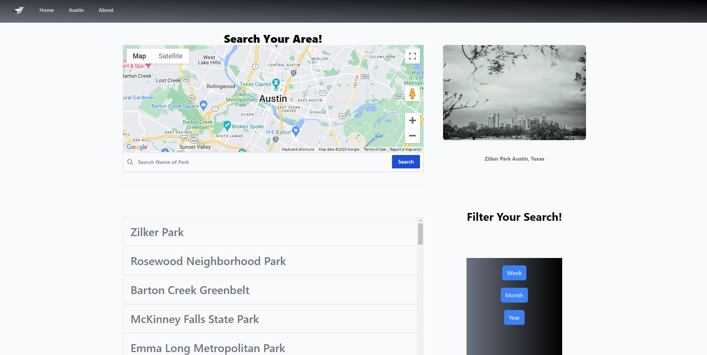

# Park-Safe

## Description
Austin is a huge city that is known for its great parks! Every park has it's beautiful scenic view and each park is great to just walk/bike around and take all the nature in. With Austin being such a big city though and parks being quite large, you never know what type of danger may happen, and you're going to want to stay safe. The most important thing is safety, and you wouldn't want to take your family for a nice evening at the park, only to put them in danger would you? Wouldn't you want to know the crime history of a certain park to know whether or not crimes happen more frequently there compared to another park?

This web-based application works to serve the greater community of Austin, Texas in an effort to positively effect the lives of its inhabitants. Our aim was to develop an application to provide a spyglass for the public. In order to do that, we coupled Google Maps API and crime data from the Austin Police Department Crime Reports API to streamline the experience for the user.

Our webpage lists 30 parks in the city of Austin and provides a list of crimes that have happened in that area. When you click on a park in the list, the map pans over to the location, and then zooms in the center of the park, and gives you the list of crimes that happened in that area. The crime list is displayed as below

Date (MM DD, YYYY, h:mm A) | Crime committed

You will also see red location pins to show you exactly where the crime was committed, and if you click on the location pin, you can see what type of crime was committed, as well as the date committed.

You can also use the search function to search for names of parks to see if the park you are looking for is on our list.

You can use the "Filter Your Search" section at the bottom right in order to filter your search by crimes that have happened the past week, month, or year.

Clicking on the "Austin" tab above brings you to the official website of "The City of Austin" where you can get even more information about Austin!

Clicking on the "About" tab will tell you about our website and the goals we had when creating this website. At the bottom is an e-mail list that you can enter your e-mail in and be updated when we add more parks to the list or when the weekly police crime list has been released so the API data gets updated.

NOTE: We are not saying that a park is dangerous based on our data. We are just giving the data that is on the Austin Police API based on the location. Bigger parks such as Zilker may have more crimes than other parks, but that is because it is the largest park in Austin so it covers more area.

## Installation
https://github.com/liq543/Park-Safe - Repo Page

You can download our repo from our repo page using the following command in git bash

"git clone git@github.com:liq543/Park-Safe.git"

or you can visit our page below

https://liq543.github.io/Park-Safe/ - Deploy Page

## Credits
https://tailwindcss.com/docs/installation - Tailwind CSS

https://developers.google.com/maps - Google Maps API

https://dev.socrata.com/foundry/data.austintexas.gov/fdj4-gpfu - Austin Police Reports API

https://www.fusejs.io/ - Fuse.js

https://unsplash.com/developers - Unisplash

ChatGPT - Helped us save time with code dealing with other third party sources. Used it to help create our buttons to be formatted in the same as Tailwind, and used it to help with the search bar that we used fuse.js to help filter the search results.

## License

https://github.com/liq543/Park-Safe/blob/main/LICENSE - MIT License

---